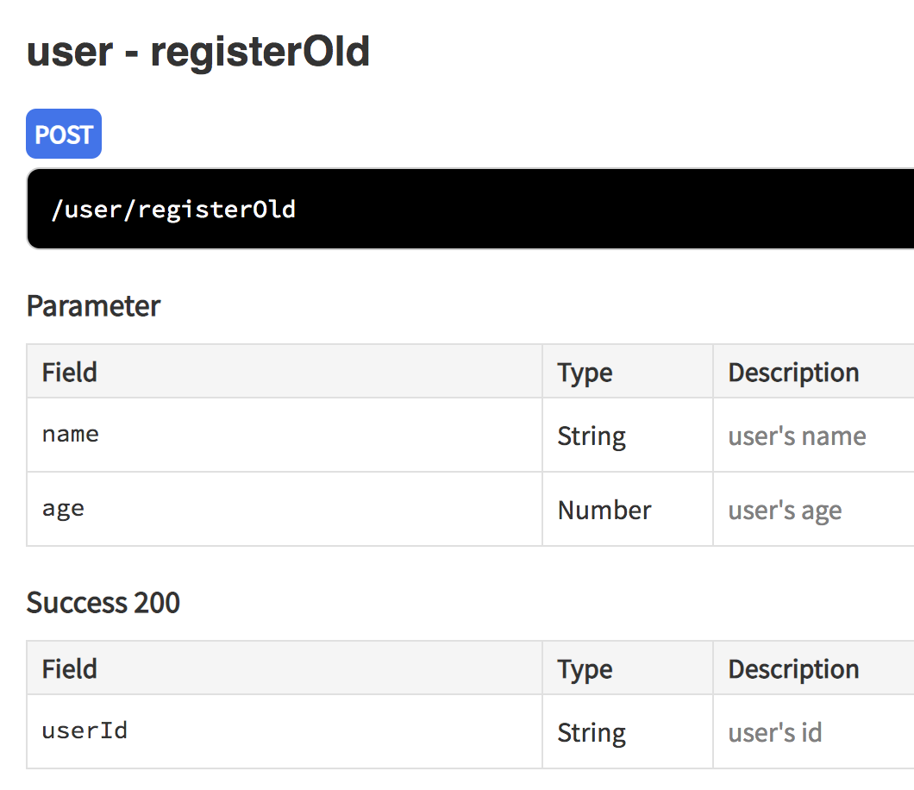

---
{
"categories": ["Typescript"],
"date": "2018-12-31",
"tags": ["Typescript", "Web", "Nodejs"],
"title": "Replace Joi with Class-validator in Typescript"
}
---
<!--more-->

## 引子

对每个接口的传入参数进行校验，是一个Web后端项目的必备功能，有一个npm包叫[Joi](https://github.com/hapijs/joi)可以很优雅的完成这个工作，比如这样子：
```
const schema = {
    userId: Joi.string()
};
const {error, value} = Joi.validate({ userId: 'a string' }, schema);
```
我们使用Typescript是希望得到明确的类型定义，减少出错的可能性。在一个后端项目中，给每个接口定义它的传入参数结构以及返回结果的结构，是一件很值得做的事情，因为这样给后续的维护带来极大的便利。比如这样子：
```
export type IFooParam = {
  userId: string
}

export type IFooResponse = {
  name: string
}

async foo (param: IFooParam): Promise<IFooResponse> {
  // Your business code
  return {name: 'bar'}
}
```
现在问题就来了，如果传入参数希望加多一个字段，我们必须得修改2个地方，一个是Joi的校验，一个是IFooParam类型的定义。有没有好的办法解决这个问题呢？

## Class-validaotr
有一个npm包叫[class-validator](https://github.com/typestack/class-validator), 是采用注解的方式进行校验，底层使用的是老牌的校验包[validator.js](https://github.com/chriso/validator.js)。其实一年前我就想试用这个class-validator包，但是没有成功，这次再试用一次，发现通过一些小包装，居然做到像Joi一样优雅的写法，而且更好用！

### 定义传入/返回结构
```
import {Length, Min, Max} from 'class-validator'

export class IRegister {
  @Length(11)
  phone: string

  @Length(2, 10)
  name: string

  @Min(18)
  @Max(50)
  age: number
}

class Button {
  text: string
}

export class ORegister {
  /**
   * user's id
   */
  userId: string

  buttons: Button[]
}
```
这里定义了2个类，IRegister为传入参数，通过class-validator规定的注解方式做校验，ORegister为返回结果。

class-validator官方提供的方式还不能直接对一个请求的body进行校验，它要求必须要是IRegister类的一个对象，所以需要做一些处理。

### 使用class-transformer做转化
跟class-validator的作者也开源了另外一个包，叫[class-transformer](https://github.com/typestack/class-transformer), 可以将一个json转成指定的类的对象，官方的例子是这样的：
```
import {plainToClass} from "class-transformer";

let users = plainToClass(User, userJson); // to convert user plain object a single user. also supports arrays
```
利用这一点，我们写一个小工具：
```
import * as classTransformer from 'class-transformer'
import {validate} from 'class-validator'
import * as lodash from 'lodash'

export class ValidateUtil {
  private static instance: ValidateUtil

  private constructor () {
  }

  static getInstance () {
    return this.instance || (this.instance = new ValidateUtil())
  }

  async validate (Clazz, data): Promise<any> {
    const obj = classTransformer.plainToClass(Clazz, data)
    const errors = await validate(obj)
    if (errors.length > 0) {
      console.info(errors)
      throw new Error(lodash.values(errors[0].constraints)[0])
    }
    return obj
  }
}
```
这个小工具提供了一个validate方法，第一个参数是一个类定义，第二个是一个json，它先利用class-transformer将json转成指定类的对象，然后使用class-validator做校验，如果校验错误将抛出错误，否则返回转化后的对象。

### 在Controller中使用

有了上面的工具，就可以方便地在代码中对传入参数做校验了，比如这样：
```
  static async register(ctx) {
    const iRegister = await ValidateUtil.getInstance().validate(IRegister, ctx.request.body)
    const oRegister = await UserService.register(iRegister)
    ctx.body = oRegister
  }
```

## 新问题
到了这里，完美地使用class-validator替换掉了Joi。

但是还有一个问题没解决，也是之前一直遗留的问题。

我们使用[apidoc](http://apidocjs.com/)编写接口文档，当新增或修改一个接口时，是通过编写一段注释，让apidoc自动生成html文档，将文档地址发给前端，可以减少双方的频繁沟通，而且对前端的体验也是非常好的。比如写这样一段注释：
```
  /**
   * @api {post} /user/registerOld registerOld
   * @apiGroup user
   * @apiName registerOld
   * @apiParam {String} name user's name
   * @apiParam {Number} age user's age
   * @apiSuccess {String} userId user's id 
   */
  router.post('/user/registerOld', UserController.register)
```
apidoc会帮我们生成这样的文档：


问题比较明显，当我们要新增一个参数时，需要修改一次类的定义，同时还要修改一次apidoc的注释，很烦，由于很烦，文档会慢慢变得没人维护，新同事就会吐槽没有文档或者文档太旧了。

理想的情况是代码即文档，只需要修改类的定义，apidoc文档自动更新。

## 探索apidoc根据class-validator的定义生成

从同事的分享中得知一个废弃的npm包，叫[apidoc-plugin-ts](https://www.npmjs.com/package/apidoc-plugin-ts), 可以实现根据ts的interface定义来生成apidoc的。官方的例子：
```
filename: ./employers.ts
 
export interface Employer {
  /**
   * Employer job title
   */
  jobTitle: string;
  /**
   * Employer personal details
   */
  personalDetails: {
    name: string;
    age: number;
  }
}
```

```
 @apiInterface (./employers.ts) {Person}
```
会转化成：
```
 @apiSuccess {String} jobTitle Job title
 @apiSuccess {Object} personalDetails Empoyer personal details
 @apiSuccess {String} personalDetails.name
 @apiSuccess {Number} personalDetails.age
```
虽然不知道为什么作者要废弃它，但是它的思想很好，源码也很有帮助。

给我的启发是，参考这个npm包，写一个针对class定义来生成apidoc的插件就行了。

## 造轮子: apidoc-plugin-class-validator

轮子的制造细节不适合在这里陈述，基本上参考apidoc-plugin-ts，目前已经发布在npm上了，[apidoc-plugin-class-validator](https://www.npmjs.com/package/apidoc-plugin-class-validator)

## 使用apidoc-plugin-class-validator

以上面的注册接口为例，使用方法：
```
  /**
   * @api {post} /user/register register
   * @apiGroup user
   * @apiName register
   * @apiParamClass (src/user/io/Register.ts) {IRegister}
   * @apiSuccessClass (src/user/io/Register.ts) {ORegister}
   */
  router.post('/user/register', UserController.register)
```

就会生成文档：


后续新增字段，只需修改IRegister类的定义就行，真正做到了修改一处，处处生效，代码即文档的效果。

文中的demo代码在[这里](https://github.com/zhengyhn/apidoc-plugin-class-validator-demo)，这是一个简单的web后端项目，看代码更容易理解。